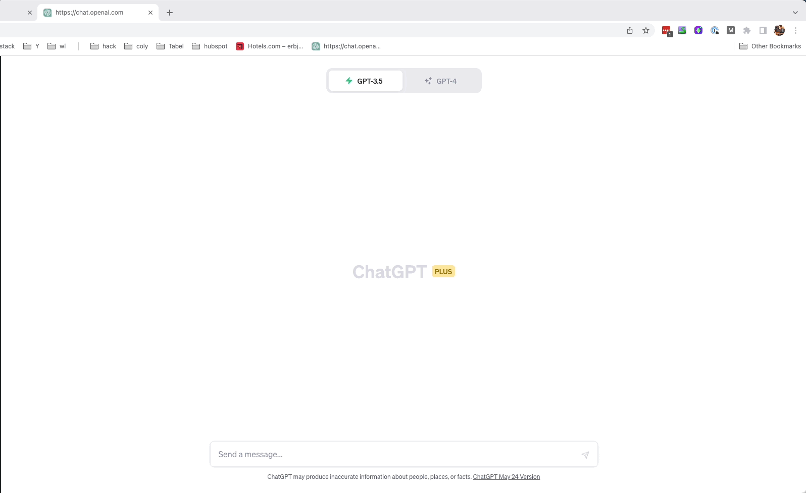

# Chat GPT paster chrome extension

Tired of repetitively explaining the same concepts to ChatGPT? This compact Chrome extension lets you quickly paste predefined text and adjust the prompt size. Plus, with a simple configuration, you can easily add your own custom buttons.





## Installation

1. **Download the repository:** Clone this repo, or use the "Code" button on the repository page to download the ZIP file and extract it.
2. **Open Chrome Extensions page:** Navigate to `chrome://extensions/` in Chrome.
3. **Enable Developer Mode:** Toggle "Developer Mode" on in the top right of the Extensions page.
4. **Load Unpacked Extension:** Use the "Load unpacked" button to select the extracted repository folder. The extension is now active in Google Chrome.
5. **Setup Custom Buttons:** Duplicate `resources/textsConfig.json` to `custom-texts/textsConfig.json` to configure custom buttons. Changes in `custom-texts` aren't tracked by git.


## Structure

- `manifest.json`: Provides the extension's metadata and permissions.
- `popup.html`: Renders the body of the extension's popup.
- `popup.js`: Houses the extension's main logic, including functions to create buttons and load text from files.

## Adding More Buttons

To add more buttons that paste different texts when clicked, you will need to follow these steps:

1. **Create a text file**: Create a new `.txt` file in the `custom-texts` directory with the text you want the button to paste.

2. **Configure `textsConfig.json`**: After duplicating `resources/textsConfig.json` to `custom-texts/textsConfig.json`, open the new file and define your custom buttons as follows:
   ```json
   {
     "title": "Your Button Name",
     "textfile": "your-text-file.txt"
   }
   ```

Replace **`"Your Button Name"`** with the name you want to display on the button, and **`"your-text-file.txt"`** with the name of the text file you created in the **`custom-texts`** directory. **`custom-texts/*.txt`** and **`custom-texts/*.json`** files will not be tracked by git.
